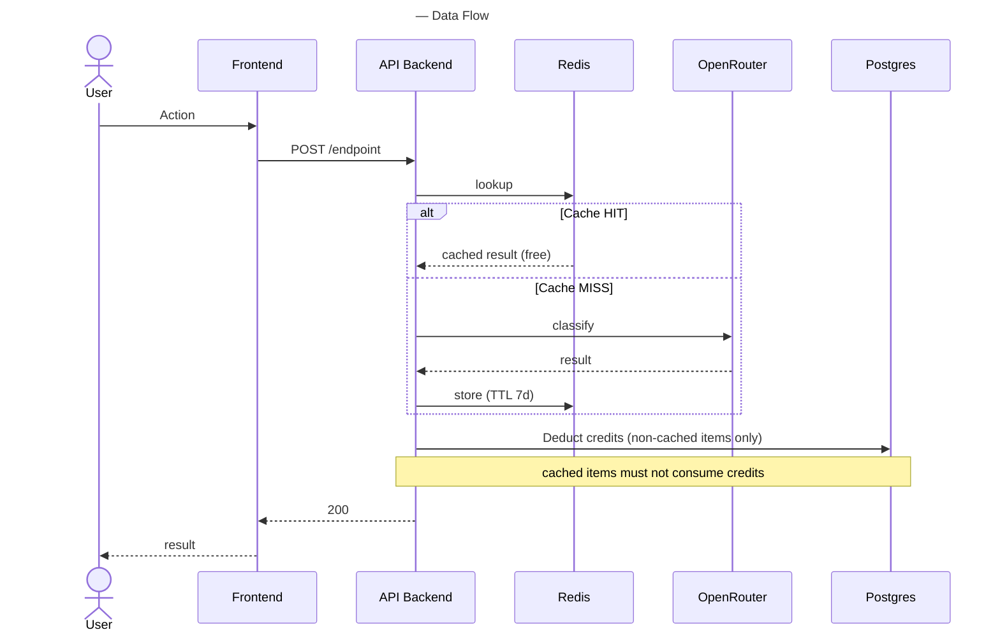

# Sub-agent prompt — C4 Data-Flow / Sequence Diagram (per pipeline)

Spawn one sub-agent per major pipeline (a request/job flow with a clear start, a clear end, and cross-container calls in
between). `subagent_type: "general-purpose"`.

---

Your task: trace the sequence of calls for the `<PIPELINE_NAME>` flow in the repository at `<REPO_PATH>`. Output a
Mermaid `sequenceDiagram` showing the full interaction from actor to persisted result.

Participants to include:

- The starting actor (user role, cron, webhook source).
- The frontend/UI layer, if any.
- Each container involved (backend, worker, MCP server, etc.).
- External systems the flow touches (AI APIs, payments, email, storage, etc.).
- Any databases or caches that are read or written.

Constructs to use where they actually exist in the code:

- `loop` — genuine iteration (batch processing, polling).
- `alt` / `else` — branches (cache hit vs. miss, authenticated vs. anonymous, etc.).
- `par` — concurrent work (parallel external calls, fan-out jobs).
- `Note over` — invariants and business rules that callers must respect ("charged only on cache miss", "deduplicated by
  hash", "admin-only"). **These notes are the most valuable part of the diagram** for agents that will later edit the
  code, because they encode constraints that are not otherwise expressible in type signatures.

Evidence:

- Find the route handler or job entry point. Follow every call it makes, in order.
- Where the code calls a shared service (`runPipeline`, `classifyItem`, etc.), descend into that service and record its
  external calls too — the caller does not see them but the diagram must.
- Error paths: include retry loops if the code has them, but don't invent error handling that isn't there.

Thinking-budget instructions — before emitting the diagram, list:

1. Starting actor and end state.
2. Every cross-container or external call in order.
3. Business rules you want to capture as `Note over` annotations, with the file/line they came from.

Output — one Mermaid block, no prose:

Keep participant count ≤ 8 for legibility. If the pipeline has more than 8 participants, split it into multiple C4
diagrams (e.g., `c4-<pipeline>-request.mmd` and `c4-<pipeline>-background.mmd`).
